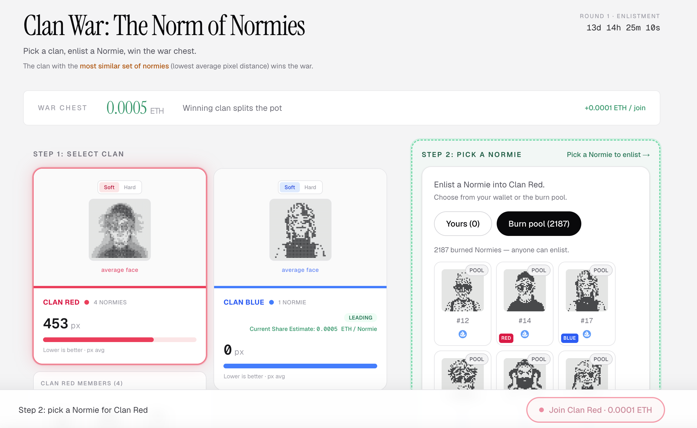
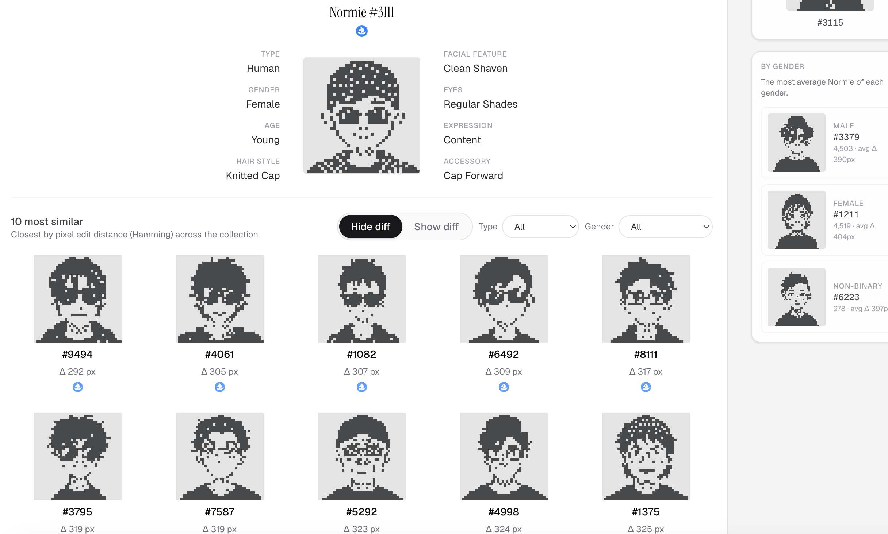
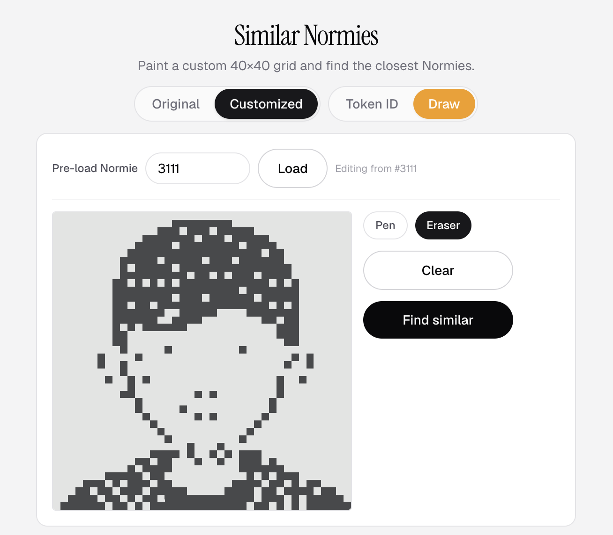
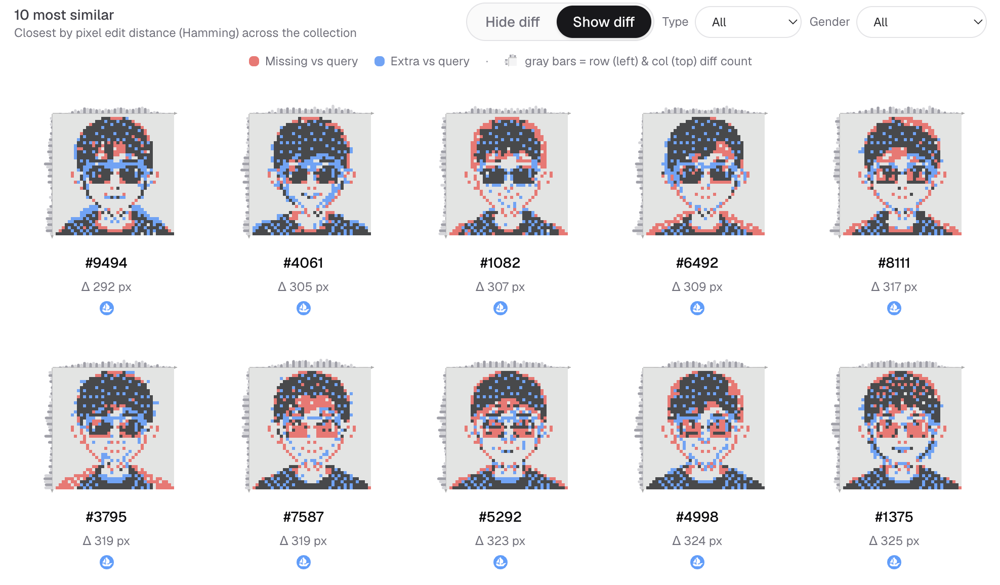

# The Norm of Normies

I've built 1) a game and a 2) a tool for normies that plays with the normies pixel Hamming distance.

1. **Clan War (Game)** — a fully on-chain red vs blue game where clans compete on pixel similarity
2. **Similar Normies Search (Tool)** — explore the collection by pixel similarity, with a draw-your-own query mode

**Live app:** [normies-clan.vercel.app](https://normies-clan.vercel.app/) 

---

## Why pixel distance?

The fully on-chain pixel canvas is at the core of what makes Normies unique.

In **Clan War**, the entire winning condition revolves around pixel similarity. Players can strategically use the pixel editing feature to influence their clan's chances of victory. To ensure fair resolution, a Normie's pairwise pixel distance is **recorded at the moment it joins** a clan. If a player edits their Normie afterward, they must pay a small fee to **evict and re-enlist** it before the updated pixels can affect the clan's score.

---

## 1. Clan War

A **100% on-chain** game where players enlist a Normie they own — or, if they are not a holder, pick one from the **burn pool** — into Red or Blue. Each join pays a small fee; **100% of join fees go to the prize pool**.

The clan with the **most visually similar set of Normies** (lowest average pairwise pixel distance) wins the war. All members still enlisted in the winning clan when the round resolves **share the prize pool**.

Because the goal is overall **visual coherence**, any player can strategically enlist or evict "outlier" Normies — in their own clan or an opponent's — to shift the average score.

Our game contract reads pixel data directly from Normies' on-chain **NormiesStorage** (raw 40×40 bitmap) and **transformed / canvas storage** (customization XOR layer when a Normie has been edited).



### Rules

**Rounds**
- Each round has a **15-day enlistment window**.
- After the window closes, anyone can call `resolveWar` to pick a winner, pay out the pot, and start the next round.

**Join**
- Pay the **join fee** (default 0.001 ETH) to enlist a Normie in Red or Blue.
- Enlist from **your wallet** (must own or be approved on the Normie) or from the **burn pool** (sacrificed Normies with no owner).
- Each Normie can only be in one clan per round. Max **25 normies per clan**.
- Join fees accumulate in the **war chest**.

**Evict**
- Anyone can evict an enlisted Normie during the enlistment window for **2× the join fee**.
- Half goes to the war chest, half to whoever originally enlisted that Normie.
- A clan must have **more than 3 normies (4+ enlisted)** before evictions are allowed.
- Evicted normies **cannot rejoin the same clan** that round.
- Evicting does **not** qualify you for a war chest share — only normies still enlisted in the **winning clan** when the round resolves get paid.

**Winning**
- Lower **average pairwise Hamming distance** wins (tighter pixel similarity).
- Ties break on clan size, then pot split rules in the contract.
- The war chest is split evenly among all normies enlisted in the winning clan at resolution time.

**Customize & rejoin**
- Clan scores reflect each Normie's pixels **as of enlistment**.
- If you customize your Normie on-chain, **evict yourself and rejoin** (paying the evict + join fees) for the new pixels to count toward your clan's score.

### Fully on-chain scoring

**Pairwise pixel distances are computed entirely on-chain** on every join and eviction.

On each join, the contract:
1. Reads the Normie's **200-byte bitmap** from **NormiesStorage** (and transformed/canvas storage when customized)
2. Computes Hamming distance against every existing clan member
3. Incrementally updates the clan's mean pairwise distance — **O(n) per join**, not O(n²) over the full roster

Only distances between the **newly affected normie and existing clan members** are recomputed; the running sum stays consistent.

### Our contract

**NormiesClanWar** (UUPS proxy) on Ethereum mainnet — [view on Etherscan](https://etherscan.io/address/0x50c03f8e22375cdfe61776cd259c2d6affd82f77)

Contract source: [`contracts/contracts/NormiesClanWar.sol`](contracts/contracts/NormiesClanWar.sol)

---

## 2. Similar Normies Search

A discovery tool that finds visually similar Normies based on pixel similarity, including a **draw-your-own Normie** query mode that lets users sketch a design and search for matching Normies.

Search runs over all 10,000 Normies using precomputed Hamming distance. As a side quest, we computed the collection **medoid** — the single Normie with the smallest total pixel distance to every other Normie (the most "average" face in the set). The search UI opens on that token by default, and we also computed per-gender medoids for fun.

**Search by token ID** — enter a Normie # and see the closest matches in the full collection.



**Draw your own** — use the 40×40 pixel grid editor (pen / eraser) to sketch a face, then search for normies with the smallest Hamming distance to your drawing.



**Filters** — narrow results by trait (type, gender) when trait metadata is loaded.

**Pixel diff view** — toggle per-pixel diff charts between your query and each result.



**Pixel source toggle** — compare against **original** on-chain pixels or **customized** (composited) pixels.

Client-side search uses bundled pixel maps in `frontend/public/normies/` (`pixels.json`, optional `pixels-diff.json`, `traits.json`).

---

## Normies API usage

Base URL: **`https://api.normies.art`**

I utilized several API endpoints, including burn history, original/customized pixel fetching, and holder addresses. **Original Normies are cached locally** (`pixels.json`, etc.) for efficient Similar Normies search.

### Clan War (live)

| Endpoint | Used for |
|----------|----------|
| `GET /normie/{id}/pixels` | Composited pixel strings (clan average face, live drawer preload) |
| `GET /normie/{id}/image.svg` | Composited Normie images in the UI |
| `GET /history/burned/{id}/image.svg` | Burn-pool Normie images |
| `GET /holders/{address}` | Load Normies owned by connected wallet |
| `GET /history/burned-tokens` | Paginated list of burn-pool token IDs |
| `GET /history/burns` | Burn commit metadata (burn pool loader) |

### Similar Normies Search

| Endpoint / data | Used for |
|-----------------|----------|
| `GET /normie/{id}/original/image.svg` | Thumbnails in search results |
| Bundled `pixels.json` | Offline Hamming search over all 10k original pixels |
| Bundled `pixels-diff.json` | Optional customized-pixel search mode |
| Bundled `traits.json` | Type / gender filters and trait panels |

API docs reference: [`llm.txt`](llm.txt)

### API feedback

I've shared few suggestions regarding the endpoint on twitter. https://x.com/ubinhash/status/2061860125842039171

---

## Technical notes

### Burn-pool check (`ownerOf` + try/catch)

I may be missing something, but I didn't find an on-chain method to directly check whether a Normie has been **burned**. On mainnet, burned Normies cause `ownerOf` to **revert** rather than return `address(0)`.

As a workaround, the contract verifies burn-pool eligibility with `try normies.ownerOf(tokenId) catch { … }` — a revert is treated as "in burn pool."

**Side effect:** you may see a **yellow warning** on Etherscan during `joinClan` if you enlisted a burned Normie from the burn pool. This is an **expected side effect, not a bug** — the transaction succeeds and the game works normally.


---

## Repo layout

```
frontend/          Next.js app (Clan War + Similar Normies Search)
contracts/         NormiesClanWar UUPS proxy + tests
scripts/           Offline data prep (not required to run the app)
```
